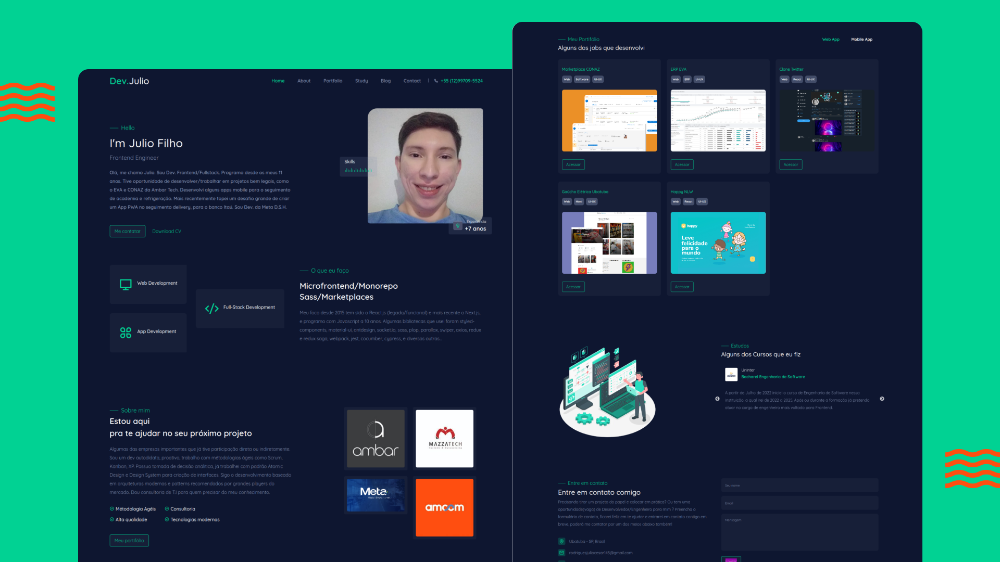

<h1 align="center">
    
</h1>

<h4 align="center"> 
	:heavy_check_mark: Portfolio Website 🚀 :heavy_check_mark:
</h4>
<p align="center">	
	
  <a href="https://www.linkedin.com/in/julio-cesar-filho-759653171">
    
  </a>
</p>
<p align="center">
</p>

O projeto Portfolio Website foi feito com Next.js. Ele é um site institucional lista minhas experiências e minha história como desenvolvedor. Foi utilizado o conceito de componentização a base do styled components onde todo componente é uma classe javascript ao invés de html simples do React.

O projeto é 100% responsivo tendo tamanhos adaptados até mesmo para tablets

:rocket: Technologies

O projeto foi desenvolvido utilizando as tecnologias abaixo:

- [Next.js][nextjs]
- [Typescript][typescript]
- [Styled Components][styled-components]
- [Bootstrap][bootstrap]

:globe_with_meridians: Acesso o projeto clicando [aqui](https://devjulio.com.br).


:construction: Como testar:

Clone a aplicação utilizando o [Git](https://git-scm.com), [Node.js][https://nodejs.org] + [Yarn][https://yarnpkg.com]. Tenha o node e o yarn nas versões mais recentes. Eu usei o Node na V16.15.1.

Rode os seguintes comandos abaixo:

### :gear: Instalar o Front-end portfolio-website-nextjs

```bash
# Clone this repository
$ git clone https://github.com/JulioCesar012/portfolio-website-nextjs.git

# Go into the repository
$ cd portfolio-website-nextjs

# Install dependencies
$ yarn

# Rodar em desenvolvimento
$ yarn dev

# Rodar em modo produção
$ yarn build
$ yarn start

# running on port 3000
```

Made with ♥ by JulioCesar012 :wave: [Get in touch!](https://www.linkedin.com/in/julio-cesar-filho-759653171/)

[nextjs]: https://nextjs.org
[typescript]: https://www.typescriptlang.org
[styled-components]: https://styled-components.com
[bootstrap]: https://reactstrap.github.io
